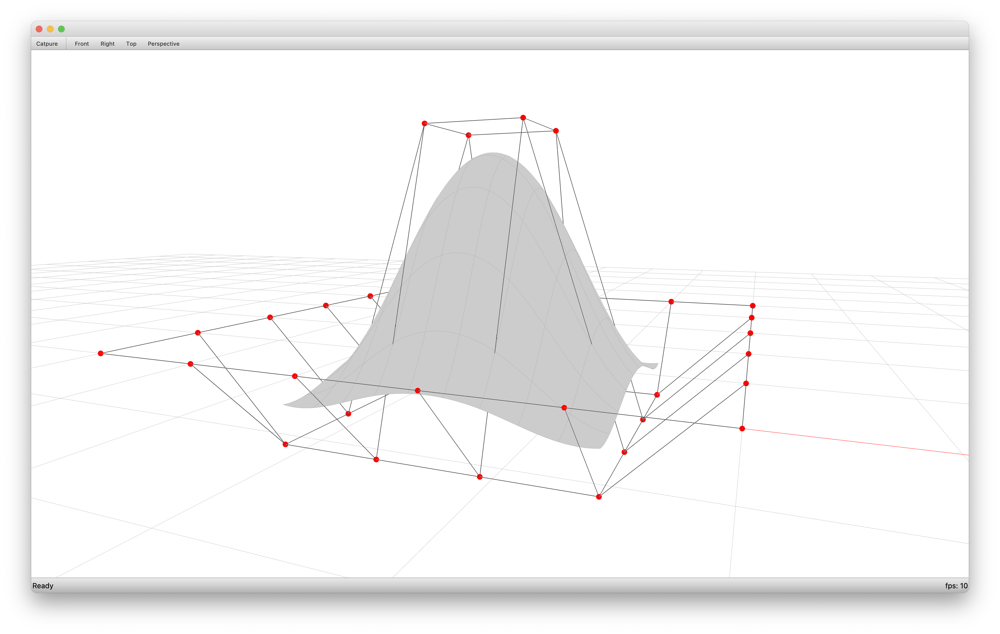

---
hide:
  - toc
---

# COMPAS OCC

COMPAS OCC provides an easy-to-use interface to the Python bindings
of the [3D modelling kernel of Open CasCade](https://www.opencascade.com/open-cascade-technology/).

`compas_occ.geometry` defines `compas_occ.geometry.Curve`, `compas_occ.geometry.NurbsCurve`, `compas_occ.geometry.Surface` and `compas_occ.geometry.NurbsSurface`, which are wrappers around `Geom_Curve`, `Geom_BSplineCurve`, `Geom_Surface` and `Geom_BSplineSurface` of OCC, repsectively.

The `compas_occ` wrappers provide an API for working with NURBS curves and surfaces similar to the API of RhinoCommon.
`compas_occ.brep` is a package for working with Boundary Representation (Brep) objects with the NURBS curves and surfaces of `compas_occ.geometry` as underlying geometry.
